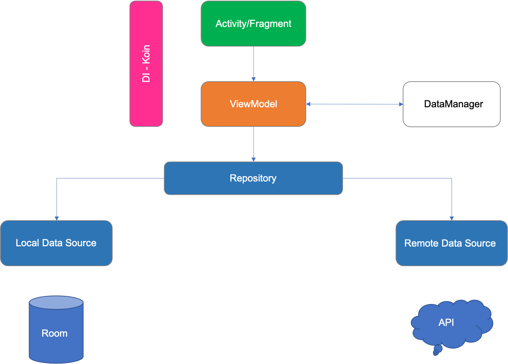

# Movies DB

## Overview
The application gets popular movies, according to country you are currently in, from [TMDB](https://www.themoviedb.org/) API.
You can add movies to favourites default list and also add multiply watchlists.

### Arcitecture
I have used MVVM arcitecture, follwing chart demonstrates it

### Libraries
- Coroutines - Handling background tasks
- Glide - Load images into views
- Koin - Dependency Injection
- Loading-dots - Dots animation for Splash screen
- Room - Local database to get data from local source
- Retrofit - Http client to get data from remote source
